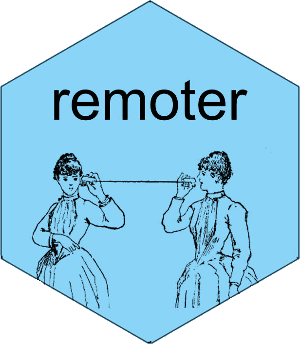
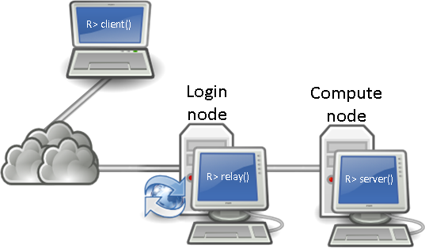

# Introduction



The **remoter** package [[@remoter]] allows you to control a remote R session from a local one.  The local R session can be in a terminal, GUI, or IDE such as RStudio.  The remote R session should be run in the background as, well, a server.

The package uses **ZeroMQ** [[@zeromq]] by way of the R package **pbdZMQ** [[@Chen2015pbdZMQpackage]] to handle communication.  Our use of pbdZMQ is specialized to client/server communications, but the package is very general.  For more details about **pbdZMQ** see the **pbdZMQ** package vignette [[@Chen2015pbdZMQvignette]].

The work for remoter was born out of the **pbdCS** package [[@pbdCS]], which is part of the Programming with Big Data in R (pbdR) project [[@pbdR2012]]. pbdR is a series of R packages that enable the usage of the R language on large distributed machines, like clusters and supercomputers.  See [r-pbd.org/](http://r-pbd.org)) for details.


## Installation

You can install the stable version from CRAN using the usual `install.packages()`:

```r
install.packages("remoter")
```

The development version is maintained on GitHub.  You can install this version using the `devtools` package:

```r
devtools::install_github("wrathematics/remoter")
```


# Clients and Servers:  Just the Basics

If you simply want to understand how **remoter** works, we do not need to involve remote computers right out the gate.  Instead, we will create a local server and connect to it from another local R session.

So the first thing to do is to start up 2 separate R sessions.  One will be the *server*, receiving commands, and the other will be the *client*, sending them.


## The Server

In the R process designated to be the server, we will use the `server()` command to, well, start the server.  Running this with no additional arguments will create a server.  Optionally, one can specify a password via the `password` argument.  Another useful feature is setting `showmsg=TRUE`, which will show in the server R process what messages are coming in.  For now, let's run it with `showmsg=TRUE`:

```r
remoter::server(showmsg=TRUE)
```

That's it!  That R session is now listening for commands.  We can shut the server down in a few ways.  Probably the best (particularly when dealing with remote machines) is from the client itself.  More on this later.  The other way is to kill the hosting R process.  Finally, you can terminate the server with `ctrl+c`, but the other methods are preferred.


## The Client

Once the server is set up, we can connect to it with the `client()` command.  Since we are connecting to a local server, the address we want to connect to is `"localhost"` (the default) or `"127.0.0.1"`.  We will have to make sure that the `port` argument matches the listening port of our server, or we'll never connect.  Finally, we can set the way the R prompt looks while the client is running by the `prompt` argument.  You can set it to whatever you like, but disambiguating between your regular, local R session and the **remoter** client is very useful.  Things can get confusing in a hurry if you aren't careful.

So to connect, in our R session designated to be the client (the only one left), we would enter:

```r
remoter::client()
```

And you should be good to go.  You can now enter R commands in the client and have them executed on the server.  The following section will go into more detail about specifics on using the client/server setup.


# Using remoter

Before proceeding, make sure you understand how to set up a client and a server.  See the previous section for details.


## Philosophy

By default, all code entered to the client is executed on the remote server.  There are several utility functions to help execute code on the local R session (see section below).  But you should assume that anything entered into the client session, *unless you explicitly specify to the contrary*, is executed only on the server.


## Utility Functions

There are a few utility functions available that have to do with handling execution of things locally or moving data between client and server.

By default, all commands entered inside of the client are executed on the server.  If you need to do some things in the local R session, you can kill the client and just reconnect when you're ready. Alternatively, you can use the `lsc()`, `rmc()`, and `evalc()` functions.  These are client versions of `ls()`, `rm()`, and `eval()`.  

For moving data between client and server, there are the `s2c()` and `c2s()` commands which transfer from server to client and from client to server, respectively.  These functions transfer data that resides in the memory of the client/server.  To transfer a file in chunks (without reading all of it into memory), see `?pbdZMQ::zmq.sendfile` or `?pbdZMQ::zmq.recvfile`.


## Shutting Things Down

To terminate the client, enter the command `exit()`.  By default, this will terminate the local client only, and leave the server running.  If you wish to also shut down the server with the client, you can run `exit(client.only=FALSE)`.  For hopefully obvious reasons, you can not terminate the server and leave the client running.

From the client side, running `exit()` will not shut down the interactive R session that was hosting the client.  You can also disconnect the client from the server without shutting down the server by killing the client R session or executing `Ctrl-c` in the client.


## Security

Security in **remoter** comes in two forms currently:

1. password credentialing
2. public key encryption

The password is declared when the server is spawned as a launch option in `remoter::server()`.  Without the use of encryption, it will be transmitted from client to server unsecurely.

Encryption is optional, and disabled by default.  This is because encryption is handled by the **sodium** package [[@sodium]], which uses the **libsodium** [[@libsodium]] library, which can be difficult to build on some platforms.  

If you have the **sodium** package installed *on both the client and the server*, start the server with the option `secure=TRUE`, and your client will automatically connect securely.  If the server was launched (by necessity or optionally) with `secure=FALSE`, then the client can not connect securely, even if the client machine has the **sodium** package installed.

If ever in any doubt, use the `is.secure()` command from the client to see if communications are encrypted.


# Working with Remote Machines

Before we begin, a quick word about addresses and ports.  

An address should not include any protocols, like `tcp://` or `http://`.  The address should also not contain any ports (denoted by a `:`), as this value goes in a separate argument.

A port is a non-negative integer.  The minimum value for a valid port is 1024 (values 1-1023 are privileged), and the maximum value is 65535.  That said, you are strongly encouraged to use port values between 49152 and 65535. See `?pbdZMQ::random_port` for details.

Of course, all the usual issues apply.  The server should be able to accept communications on the desired port.  One way to handle this is by opening the desired port.  Opening ports is very standard stuff, but dependent on the system you are using, so consult relevant documentation if you aren't sure what to do.  Another way is by tunneling over ssh, which we mention at the conclusion of this section.


## Creating a Remote Server

Before beginning, you need to spawn your server.  To do this, you can:

1. ssh to your remote (you only need to do this once!)
2. Start a **tmux** or **screen** session
3. Start R and run `remoter::server()` (see `?server` for additional options).  Or even better, run `Rscript -e remoter::server()` so the server dies if something goes wrong.
5. Detach your tmux/screen session and log out.

Alternatively, you can run the R session in the background by a fork via something like:

```r
Rscript -e "remoter::server()" &
```

Though I personally recommend using something like **tmux** or **screen** instead.


## Connecting to a Server

Connect as with a local server, but specifying the correct remote address:

```r
remoter::client("my.remote.address")
```

So for example, say you have set up a server (as described above) on EC2 with address `"ec2-1-2-3-4.compute-1.amazonaws.com"`, listening on port `56789`. Then you would run:

```r
remoter::client("ec2-1-2-3-4.compute-1.amazonaws.com", port=56789)
```

That's it.  Everything else should work just as when you were running the server locally.


## tunneling Over ssh

If you can't or don't want to open up a port on a remote system, you can always tunnel over ssh (assuming of course you actually have legitimate access to the machine...).

Say you have user account `user` on remote with address `my.remote.machine`.  Suppose your remote machine is running a **remoter** server, listening on port 55555.  Then you can run:

```
ssh user@my.remote.machine -L 55556:localhost:55555 -N
```

To be totally unambiguous:

* server port (running on remote): 55555
* client port (running on your laptop): 55556

This will allow you to connect to the remote machine as follows:

```r
remoter::client("localhost", port=55556)
```

You can also spawn the server in the ssh tunnel call.  For example, you might run:

```
ssh user@my.remote.machine -L 55556:localhost:55555 'Rscript -e "remoter::server(port=55555)"'
```

This will automatically launch a **remoter** server listening on port 55555, tunneled over `localhost:55566`.  If you are working on a managed system, like a cluster or supercomputer, you might need to run something like `module load R` first:

```
ssh user@my.remote.machine -L 55556:localhost:55555 'module load R && Rscript -e "remoter::server(port=55555)"'
```


## Working with Relays

As of **remoter** version 0.3-1, you can now set up "relays".  These serve as "middlemen" between the client and server, and are particularly useful for resources like clusters and supercomputers where the login and compute nodes are separate.  Internally, the relay is a server that does nothing but pass messages between the client and server.

The diagram below shows the basic setup for using a relay:

<div class="centerfig">
  
  <div class="caption">A diagram showing the relationship between client, relay, and server.  Image composed of icons from the <a href="http://www.opensecurityarchitecture.org/cms/library/icon-library">OSA Icon Library</a></div>
</div>

To spawn a relay, you can do:

```r
remoter::relay(addr=my.server.addr, sendport=my.server.port)
```

As the name suggests in the above example, `my.server.addr` and `sendport` represent the address and port of the server (what you would use for `addr` in `remoter::client()` if you could connect directly).  Then the client will connect to the relay, not the server (that's the whole point!) something like:

```r
remoter::client(addr=my.relay.addr, port=my.relay.port)
```

Here `my.relay.addr` is the address of the relay, and `my.relay.port` should math the argument `recvport` used when creating the relay (default is `r as.integer(formals(remoter::relay)[["recvport"]])`).


# Problems, Bugs, and Other Maladies

The package should basically be useable, but there are some issues you might want to be aware of.

**Problem**: I lost my internet connection and the client is no longer sending messages.

**Solution**: Just `Ctrl+c` the client and re-run the `remoter::client()` call and you should be good to go.  The server should still be running.  You can therefore also have multiple clients connect to the same server, and they will share the same data (though they will not see each other's commands).  I actually consider this a feature, but I'm not married to it and I could probably be convinced to change it.
<br><br>


**Problem**: The up/down arrow keys don't work right in the R terminal when using the client.

**Explanation**: That's because the client is just some R code sitting on top of the R REPL.  This shouldn't be a problem if you're using an IDE like RStudio or the like, where you pass commands from an editor window to the R session.  But as far as I am aware, this can not be fixed.
<br><br>


**Problem**: There's no security!

**Explanation**: Currently there is a password system that works by simple string comparison, and communication can be encrypted via the **sodium** package.  You must have **sodium** installed on both the client and server machine, and start the server with the option `secure=TRUE` to use this, however.  Additionally, it is possible I messed the public key part up, so if you believe that ot be the case, I'd really like to know about it.  We are also considering adding CurveZMQ support directly to pbdZMQ in the future.
<br><br>


**Problem**: Something else is wrong!

**Explanation**: Please be so kind as to [file an issue](https://github.com/wrathematics/remoter/issues) describing the problem.  Be as descriptive as possible.


# Legal

&copy; 2015-2016 Drew Schmidt.

Permission is granted to make and distribute verbatim copies of this vignette and its source provided the copyright notice and this permission notice are preserved on all copies.

Work for the **remoter** package is supported in part by the project *Harnessing Scalable Libraries for Statistical Computing on Modern Architectures and Bringing Statistics to Large Scale Computing* funded by the National Science Foundation Division of Mathematical Sciences under Grant No. 1418195.

Any opinions, findings, and conclusions or recommendations expressed in  this material are those of the authors and do not necessarily reflect the  views of the National Science Foundation.  The findings and conclusions in this article have not been formally disseminated by the U.S. Department of Health \& Human Services nor by the U.S. Department of Energy, and should not be construed to represent any determination or policy of University, Agency, Administration and National Laboratory.

This manual may be incorrect or out-of-date.  The authors assume no responsibility for errors or omissions, or for damages resulting from the use of the information contained herein.

The **remoter** logo comes from the image "Tradtelefon-illustration". Licensed under Public Domain via [Commons](https://commons.wikimedia.org/wiki/File:Tr%C3%A5dtelefon-illustration.png#/media/File:Tr%C3%A5dtelefon-illustration.png).


# References
<script language="JavaScript" src="include/headers.js"></script>
